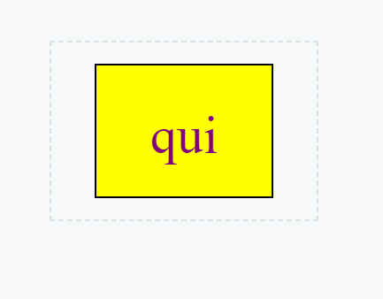
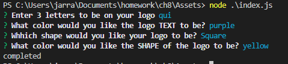

# SVG Logo Maker

## Description
 The assingment fot his was to greate a node application that takes in 4 inputs from the user to create an SVG logo.
## Table of Contents
    
    - [Installation](#installation)
    - [Usage](#usage)
    - [Credits](#credits)
    - [License](#license)

 ## Installation 

    For this project we had to install the inquirer and jest packages from node in order to prompt the user for their inputs as well as test the reliability of our code. Node can be installed form their website and once that's completed, you should be able to download inquirer and jest using "npm i inquirer jest" in the terminal. 

 ## License
    
    This project uses the following license: Unlicense. Please refer to [https://choosealicense.com/](https://choosealicense.com/).

## Questions

    You can see my GitHub Profile at https://github.com/zelada5574.

https://github.com/zelada5574/logomaker

https://drive.google.com/file/d/1DBJBmGlQTRND4XeeOA_q-dVKq22UMhln/view
